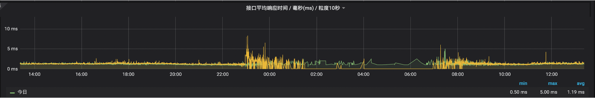
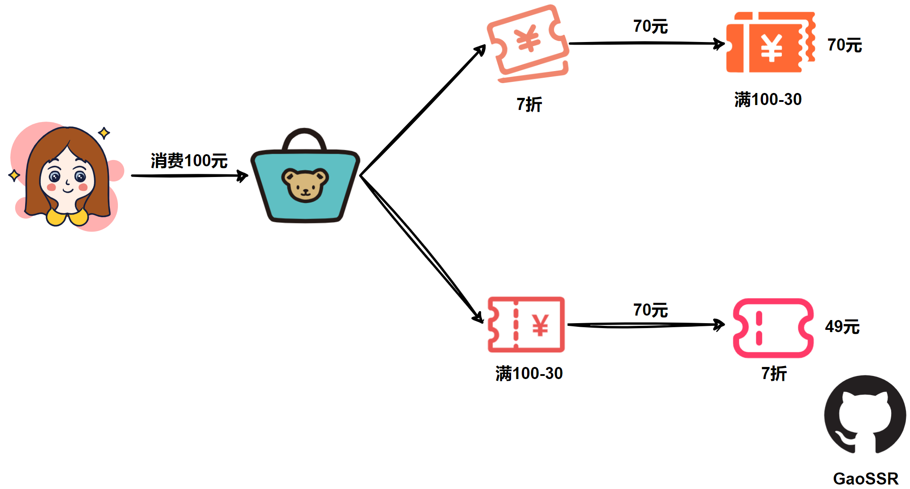

<div align=center>
  
</div>


<div align="center">
  <a href="javascript:;"></a>
  <a href="javascript:;"></a>
  <a href="javascript:;"></a>
  <a href="javascript:;"></a>
 </div>
<br />

## 轻量级算法驱动优惠叠加器

#### RT：
 


#### 背景：

优惠是推动消费者转化的关键因素，它在激发用户消费行为上起着核心作用。目前市场上的优惠策略主要涵盖了各种活动（例如拼多多的“砍一刀”，天猫农场的互动，新用户的首次购买，复购，积分等）和优惠券（如折扣券，代金券，商品券，买一赠一等）。然而，这些复杂的优惠规则使得用户在计算优惠叠加的顺序时感到困扰。这可能导致用户在面对多重优惠时降低购买商品的欲望，尤其是当他们参与了多个活动并持有多个优惠券时，这种情况更为明显。

优惠的计算顺序可以分为平行式和渐进式，其中平行式优惠之间没有相互依赖关系，而渐进式优惠之间则存在依赖关系，即下一个优惠的触发取决于上一个优惠的实施结果。

设想小晴消费了100元，她手头有一张7折优惠券和一张满100元减30元的优惠券。这两个优惠券的使用顺序可能会产生不同的效果，则这2个优惠券的使用顺序有以下两种情况：



`OnePRO`采用了一系列新颖的算法，实现了高效求解优惠排列的最优解。


#### 核心计算类 Permutation&lt;T extends GoodsItem&gt;

`Permutation`是一个重要的抽象类，作为`OnePRO`的核心，它采用了多种优化策略来确保高性能，这些策略的运用旨在提升计算效率和降低资源消耗，这些策略包括：

- 预存的排列数结果集

之所以采用这种设计，是因为在业务场景中，我们需要频繁进行排列计算。对于给定长度的序列，其排列结果是固定的。在`Permutation`类中，`PERMUTATIONS`属性存储了7以内的排列数结果集。由于这里使用了`Byte`来存储数据，因此占用的内存空间非常小，这有助于提高性能并降低内存消耗。

```Java
private final static Map<Integer,Collection<List<Byte>>> PERMUTATIONS = Maps.newHashMap();

```
这个动作在类加载完成时执行，如果觉得7不合适，对7不满意，可以通过调整`SUPPORTEDSIZE`的大小来满足业务和性能的需求。

我们在实现中经过测试和调整，确定了7是一个相对平衡的参数，它兼顾了业务与性能，当然，根据实际需求，大家可以根据自己的情况来调整这个参数。

```Java
public final static int SUPPORTEDSIZE = 7;

static{
      //前置计算 1-SUPPORTEDSIZE 之间所有排列组合
    for(byte i=1;i<=SUPPORTEDSIZE;i++){
       PERMUTATIONS.put((int)i,Collections2.permutations(IntStream.range(0,i).boxed().map(x->(byte)x.intValue()).collect(Collectors.toList())));
      }
  }

```

- $A_n^3$级别缓存

相对于传统的`Key-Value`结构，解决$A_n^n$*问题的缓存需要进行特殊设计，对于一个优惠集合而言，$A_n^3$意味着需要缓存*n*×(*n*−1)×(*n*−2)条数据。当*n=7时，需要缓存210条数据。为了在内存大小和缓存带来的性能收益之间取得平衡，$A_n^3$是最合适的级别。

`Permutation`类通过其成员变量`cache`实现了高性能缓存。

```Java
private final Map<Integer, CalcState<T>> cache = Maps.newHashMap();
```
你或许已经注意到，`cache`的键值使用的是`Integer`类型。在大多数情况下，我们更倾向于使用`String`类型，但在需要进行大量计算的场景中，比如在万次计算的场景下，String字符串的拼接却成了性能瓶颈。

为了实现高性能的键生成，`Permutation`采用了独特的方法。它通过位移对`Byte`数组的前三个字节进行扰动，以确保每个键的唯一性，同时提升性能。

```Java
private static Integer calcKey(List<Byte> a){
       return  a.size()>=3?(a.get(0) << 6)+ (a.get(1) << 3) + a.get(2):0;
}
```

`Permutation`提供了保存点来实现 $A_n^3$ 级别缓存，`CalcState` 记录了计算到第3步的状态，包括当前订单优惠金额和计算过程、已享用优惠的商品等，这些属性的保存和回放`Permutation`已经帮你做好了，`Permutation`额外提供了抽象的保存和回放方法来满足你的个性化诉求。

```Java
   /**
     * 业务将状态记录到保存点
     * @param state 保存点对象
     */
    protected abstract void makeSnapshot(CalcState<T> state,DiscountContext<T> context);

    /**
     * 业务返回保存点状态
     * @param state 保存点对象
     */
    protected abstract void backToSnapshot(CalcState<T> state,DiscountContext<T> context);
```

在优惠计算中，存在一个优先级规则，即优惠计算是有优先级的，需要确保属性`calculateGroup`值较小的优惠先行计算。当发生`backToSnapshot`时，我们需要额外检查缓存中最后一个优惠与当前正准备要计算的优惠之间的关系，如果不满足特定条件，则直接终止计算，直接跳出。而`checkIfWakeUpJump`方法会在缓存被使用后立即判断是否需要继续下去。

#### 上下文类 DiscountContext&lt;T extends GoodsItem&gt;

`DiscountContext`是上下文，也是`Permutation`的成员变量，`DiscountContext`同样包含很多优化策略：

- CalcStage数组

在变更最频繁也是最重要的计算步骤对象`CalcStage`使用数组存储，该数组随着上下文创建而创建，在`Permutation`中使用

```Java
Arrays.fill(arr,null);
```

将该数组清空并让它投入下一次计算，这样一次全排列过程中，数组只会被创建一次，避免了频繁创建数组带来的性能损耗。

- 预计算

`DiscountContext`的初始化是通过静态的`create`方法完成的，该方法将商品与优惠绑定在一起，同时执行一些用户自定义的逻辑，我们称之为“预计算”，预计算的结果被保存在`DiscountContext`的`preCompute`属性中，以便在后续的计算中直接取用，这种方法避免了在后续的高速迭代中重复执行相同的操作，如商品分组和、求和等，从而提高了计算效率。

#### 预计算 PreCompute&lt;T extends GoodsItem&gt;

预计算提供了接口，要使用预计算首先需要实现PreCompute接口

```Java
public interface PreCompute<T extends GoodsItem> {
    /**
     * 判断符合条件的活动类型，符合才会执行preComputeItems
     */
    Set<String> matchTypes();

    /**
     * 对商品做一些复杂集合操作
     * @param items 当前参与优惠的商品
     * @param discount 当前优惠
     * @param preCompute 存储计算的结果
     */
     void preComputeItems(List<T> items, DiscountWrapper discount, Map<String,Object> preCompute);
}
```

此外需要在资源目录下建立`calculator-core.properties`文件，配置内容如下

```Java
precompute.path=你要扫描的包
```
`PreComputeHolder`将处理所有的`PreCompute`实现类，只有`matchTypes`匹配的情况下，才会执行`preComputeItems`方法。

```Java
public class PreComputeHolder {
    public static Set<PreCompute> COMPUTES= Sets.newHashSet();
    private final static String PATH = "precompute.path";

    static{
        Properties properties = new Properties();
        try {
              properties = PropertiesLoaderUtils.loadProperties(new FileSystemResource(Objects.requireNonNull(PreComputeHolder.class.getClassLoader().getResource("calculator-core.properties")).getPath()));
        } catch (Exception ignore) {
        }
        String path = properties.getProperty(PATH);
        if(StringUtils.isNotBlank(path)){
            Reflections reflections = new Reflections(path);
            Set<Class<? extends PreCompute>> subTypes = reflections.getSubTypesOf(PreCompute.class);
            for(Class<? extends PreCompute> clazz:subTypes){
                try {
                    COMPUTES.add(clazz.newInstance());
                } catch (Exception ignore) {
                }
            }
        }
    }
}
```

#### 计算器 Calculator

`Calculator`是单个优惠的计算接口（即用于优惠计算的接口），它其中定义了一个`calcWarp`方法，负责具体的优惠计算逻辑，但由于`calcWarp`需要承担一些内部的事情，需要处理一些内部细节，因此为了简化使用者的开发工作，我们提供了一个抽象类`AbstractCalculator`，它实现了`calcWarp`方法，并最终暴露了一个更简单更直观的`calc`方法供使用者使用。

`AbstractCalculator`的内容如下，在`AbstractCalculator`中，`calcWarp`方法负责创建`CalcStage`对象，维护`CalcStage`数组等内部工作，这些细节对于使用者来说是透明的，他们只需要关注并实现`calc`方法即可。

```Java
public abstract class AbstractCalculator<T extends GoodsItem> implements Calculator<T> {
    public long calcWarp(DiscountContext<T> context, DiscountWrapper discountWrapper, Map<Long, T> records, byte idx, int i) {
        CalcStage stage = new CalcStage();
        CalcResult cr = context.getCalcResult();
        long price= cr.getCurPrice();
        stage.setBeforeCalcPrice(price);
        price = calc(context, discountWrapper,records, price, stage);
        if(price<0){
            return price;
        }
        stage.setAfterCalcPrice(price);
        stage.setIndex(idx);
        stage.setStageType(discountWrapper.getType());
        cr.setCurPrice(price);
        if(stage.getBeforeCalcPrice()>stage.getAfterCalcPrice()) {
            cr.getCurStages()[i] = stage;
        }
        return price;
    }

    /**
     * 返回该优惠下的最终要支付的金额,若不符合则返回 prevStagePrice
     * @param context 上下文
     * @param discountWrapper 优惠信息
     * @param records 记录享受过优惠的单品，key是calculateId，这里只提供容器，添加和判断规则由使用者自行决定
     * @param prevStagePrice 上一步计算的订单的价格
     * @param curStage 当前stage
     * @return
     */
    public abstract  long calc(DiscountContext<T> context, DiscountWrapper discountWrapper, Map<Long,T> records, long prevStagePrice, CalcStage curStage);

}

```
最终用户通过继承`AbstractCalculator`类，并在`Component`注解中指定一个值，而`CalculatorRouter`则通过这个值将请求路由到相应的优惠计算器，这个值与`DiscountWrapper`中的`type`属性相对应。

```Java
@Component("manjian")
public class ManjianCalc extends AbstractCalculator<GoodsItem> {
......
}
```


#### 共享互斥协议 DiscountGroup

共享互斥协议是一个数据结构，它是一个数组，数组中最多可以包含两个对象，最少包含一个对象。如果数组中只有一个对象，那么该对象必然为共享组，即组内的优惠可以叠加使用。

```JavaScript
[
    {
        "relation": "share",
        "items":
        [
            {
                "type": "activity0",
                "id": "11"
            }
            ,
            {
                "type": "activity4",
                "id": "13"
            } 
            ,
            {
                "type": "coupon1",
                 "id": "14"
            }
        ]
    }]
```
相应的，当数组中包含两个对象时，第一个对象的`relation`属性可以为`share`或`exclude`，而第二个对象的`relation`属性必须为`exclude`。

```JavaScript
[
    {
        "relation": "share",
        "items":
        [
            {
                "type": "activity0",
                "id": "11"
            },
            {
                "type": "card3",
                "id":"12"
            }
        ]
    },
    {
        "relation": "exclude",
        "items":
        [
            {
                "type": "card1",
                "id": "18"
            },
            {
                "type": "coupon1",
                "id": "22"
            }
        ]
    }
]
```
最终，上述协议将转化为如下两个共享组：

- `activity0-card3-card1` 和 `activity0-card3-coupon1`

工具类 `DiscountGroupUtil` 提供了一个方法，用于将协议转换为共享组。由于共享组可能包含大量优惠，为了提高过滤性能，我们将当前可用的优惠转换为二级`Map`。这个`Map`的外层键是协议中的`type`，而第二层键是协议中的`id`。通过这种方式，我们可以快速地进行交叉过滤，从而提升性能。

```Java
public static List<Pair<Set<DiscountWrapper>,Set<DiscountWrapper>>> transform(List<List<DiscountGroup>> groups, Map<String, Map<String,DiscountWrapper>> inMap);
```
为了确保计算性能，我们将用户在当前订单中可享受的优惠分为两个集合。左侧集合的大小限制为`SUPPORTEDSIZE`，即我们重点保障的、在计算能力范围内的优惠。而右侧集合则尽可能地进行叠加。

从稳定性角度考虑，我们需要对计算次数进行统计。在压力测试中，我们通过`LimitingUtil.count`方法来统计进入`calc`方法的次数。显然，在没有开启缓存的情况下，计算次数为$A_n^n$*×*n，而当开启缓存时，计算次数为$A_n^n$*×(*n−3)+$A_n^3$。

#### CASE

看了这么多概念，我们可以在`com.gch.discount.demo`包中找到实际调用的具体case：

```Java
@Controller
public class TestController {

    private final CalculatorRouter calculatorRouter;

    public TestController(CalculatorRouter calculatorRouter) {
        this.calculatorRouter = calculatorRouter;
    }

    @RequestMapping("test")
    @ResponseBody
    public Object test() {
        //mock商品
        List<GoodsItem> items = mockItems();
        //mock组关系并转化为共享组
        List<Pair<Set<DiscountWrapper>,Set<DiscountWrapper>>> pairs = transform(mockGroups());
        //全局最优计算过程
        List<CalcStage> globalStages=Lists.newArrayList();
        int count = 0;
        //订单总金额
        long totalPrice = items.stream().mapToLong(GoodsInfo::getSalePrice).sum();
        long globalPrice = totalPrice;
        //构建计算流
        Flowable flowable = (Flowable) new Flowable().build(calculatorRouter);
        for(Pair<Set<DiscountWrapper>,Set<DiscountWrapper>> set:pairs) {
            //统计算力
            count += LimitingUtil.count(set.getLeft().size());
            if(count>N){
                break;
            }
            List<DiscountWrapper> wrappers = Lists.newArrayList(set.getLeft());
            DiscountContext<GoodsItem> ctx = DiscountContext.create(totalPrice, Lists.newArrayList(items), wrappers);
            flowable.perm(ctx);
            if(ctx.getCalcResult().getFinalPrice() < globalPrice) {
                globalStages = Arrays.asList(ctx.getCalcResult().getStages());
                globalPrice = ctx.getCalcResult().getFinalPrice();
            }
        }
        return Pair.of(globalPrice,globalStages);
    }

    private List<List<DiscountGroup>> mockGroups(){
        List<List<DiscountGroup>> groups = Lists.newArrayList();
        DiscountGroup group = new DiscountGroup();
        group.setRelation(GroupRelation.SHARE.getType());
        group.setItems(Lists.newArrayList(new Item("zhekou","1"),new Item("manjian","2"),new Item("manzeng","3")));
        groups.add(Lists.newArrayList(group));
        return groups;
    }

    private List<GoodsItem> mockItems(){
        IdGenerator idGenerator = IdGenerator.getInstance();
        GoodsInfo goodsInfo = GoodsInfo.of(1001L,2001L,null,4,20 * 100,"产品1",null);
        GoodsInfo goodsInfo2 = GoodsInfo.of(1001L,2002L,null,2,10 * 100,"产品1",null);
        List<GoodsItem> items = GoodsItem.generateItems(goodsInfo,idGenerator,x->x.getExtra().put(Constant.UPDATEABLEPRICE,x.getSalePrice()));
        items.addAll(GoodsItem.generateItems(goodsInfo2,idGenerator,x->x.getExtra().put(Constant.UPDATEABLEPRICE,x.getSalePrice())));
        return items;
    }

    private List<Pair<Set<DiscountWrapper>,Set<DiscountWrapper>>> transform(List<List<DiscountGroup>> groups){
        List<DiscountWrapper> wrapperList = Lists.newArrayList(
                DiscountWrapper.of("zhekou", "1", "折扣", false, new DiscountConfig()),
                DiscountWrapper.of("manjian", "2", "满减", false, new DiscountConfig())
        );
        Map<String, Map<String,DiscountWrapper>> inMap = wrapperList.stream().collect(Collectors.toMap(DiscountWrapper::getType, x->ImmutableMap.of(x.getId(),x)));
        return DiscountGroupUtil.transform(groups,inMap);
    }
}

```


